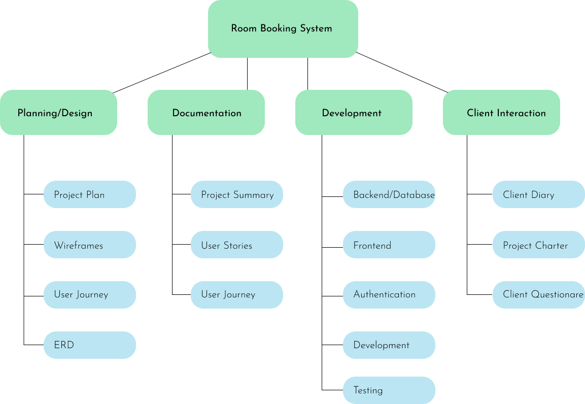
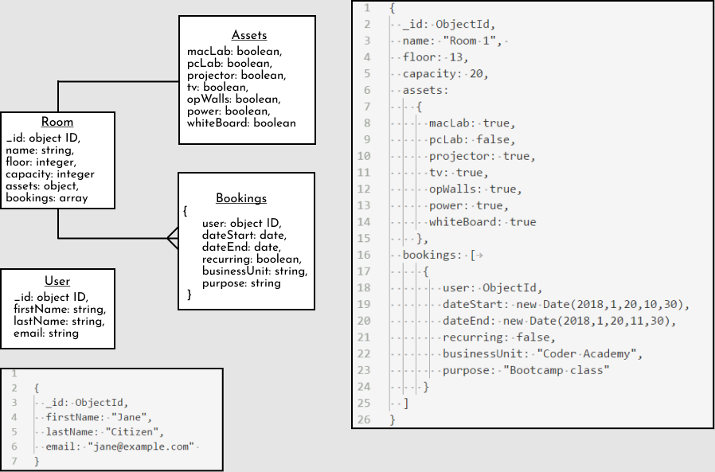
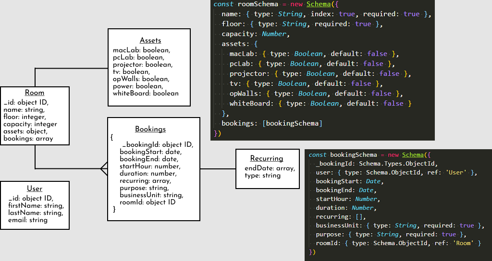
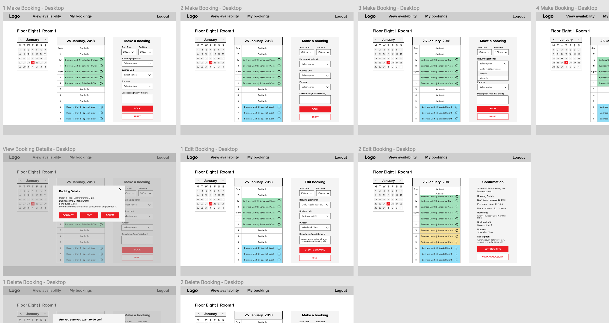
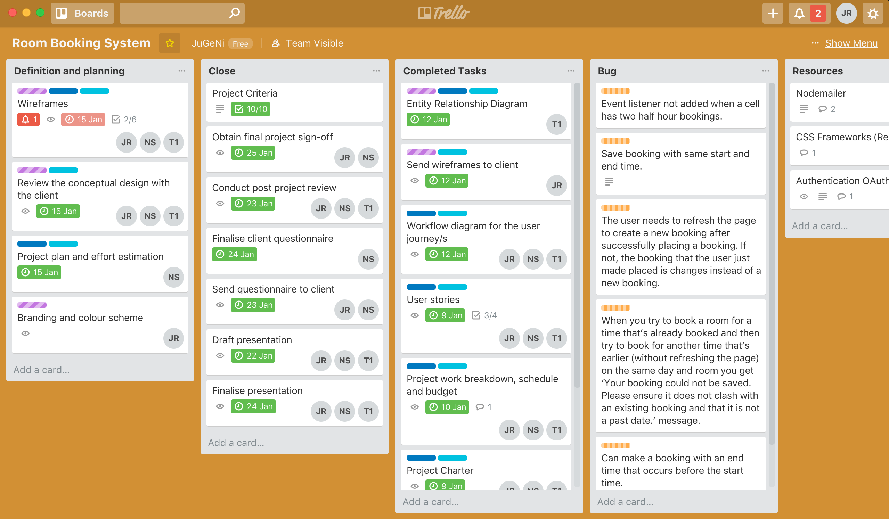

# Room Booking System
A room booking system built with MongoDB, Express, Node.js and ReactJS.


[Presentation](http://slides.com/juliaryan/room-booking-system/fullscreen)
## Table of Contents

* [Getting started](#getting-started)
  * [Prerequisites](#prerequisites)
  * [Installation](#installation)
* [About project](#about-project)
  * [Problem](#problem)
  * [Solution](#solution)
* [Planning](#planning)
  * [Audience](#audience)
  * [User stories](#user-stories)
  * [Entity Relationship Diagram](#entity-relationship-diagram)
    * [Version One](#version-one)
    * [Version Two](#version-two)
  * [Trello](#trello)
* [Design](#design)
  * [Wireframes](#wireframes)
  * [Prototype](#prototype)
* [Development](#development)
  * [Requirements](#requirements)
  * [Technologies](#technologies)
* [Challenges and final thoughts](#challenges-and-final-thoughts)
* [Team](#team)

## Getting started
These instructions will get you a copy of the project up and running on your local machine for development purposes.
### Prerequisites
#### Back-end:
- MongoDB
- Express
- Node.js

```json
  "dependencies": {
    "body-parser": "^1.18.2",
    "cors": "^2.8.4",
    "express": "^4.16.2",
    "jsonwebtoken": "^8.1.0",
    "moment": "^2.20.1",
    "moment-timezone": "^0.5.14",
    "mongoose": "^4.13.9",
    "passport": "^0.4.0",
    "passport-google-oauth20": "^1.0.0",
    "passport-jwt": "^3.0.1",
    "passport-local": "^1.0.0",
    "passport-local-mongoose": "^4.4.0"
  },
  "devDependencies": {
    "dotenv": "^4.0.0",
    "eslint": "^4.15.0",
    "eslint-config-prettier": "^2.9.0",
    "eslint-config-standard": "^11.0.0-beta.0",
    "eslint-plugin-import": "^2.8.0",
    "eslint-plugin-node": "^5.2.1",
    "eslint-plugin-prettier": "^2.4.0",
    "eslint-plugin-promise": "^3.6.0",
    "eslint-plugin-standard": "^3.0.1",
    "nodemon": "^1.14.10",
    "now": "^9.2.7",
    "prettier": "^1.10.2"
  }
```
#### Front-end:
- React.js
```json
  "dependencies": {
    "axios": "^0.17.1",
    "jwt-decode": "^2.2.0",
    "moment": "^2.20.1",
    "moment-timezone": "^0.5.14",
    "normalize.css": "^7.0.0",
    "query-string": "^5.0.1",
    "react": "^16.2.0",
    "react-datetime": "^2.11.1",
    "react-dom": "^16.2.0",
    "react-modal": "^3.1.11",
    "react-router-dom": "^4.2.2",
    "react-scripts": "1.0.17"
  },
    "devDependencies": {
    "autoprefixer-stylus": "^0.14.0",
    "concurrently": "^3.5.1",
    "stylus": "^0.54.5"
  }
```
### Installation
Clone the repo
```
git clone https://github.com/julia-/room-booking-system
```

Change to the `api` folder and install development and production dependencies.

```
cd api
yarn install
```

Change to the `web` folder and install development and producation dependencies.
```
cd web
yarn install
```

You will need to set up MongoDB. See [MongoDB](https://docs.mongodb.com/) for instructions.

Seed the data
```
yarn seed
```

For Google OAuth you will need to register an application with Google. See [passport-google-oauth2](https://github.com/jaredhanson/passport-google-oauth2) for further instructions.

Go to the `api` folder and start the server.
```
cd api
yarn dev
```

Go to the `web` folder and run the script start script.
```
cd api
yarn start
```

Open in your browser and navigate to http://localhost:3000. You access the back-end on http://localhost:7000.

## About project
You are to design, build, deploy, and present an application built for a real world customer.

Find a business or organisation nearby to Coder Academy to build an application for.

Meet with the business owner or organisation manager to find out what challenges they face. Find a problem that you can solve with an application and present your ideas to the client.

### Problem
The client has forty rooms over two floors available for use by staff, teachers and students. The booking of these rooms is currently managed using a basic spreadsheet system. This method is inflexible, cumbersome and does not allow for a high degree of specificity with respect to booking times. It also does not give the client a clear understanding of how their rooms are used and how the use of these resources can be optimised.
### Solution
A web-based application that allows the client (including its administrative staff, teachers and students) to login from anywhere to easily, accurately and quickly make room bookings.

This will help to ensure that room resources are used as fully-utilised as possible, whilst avoiding double-bookings and other common user frustrations. It will also make room booking statistics available to the client's staff and management to assist their planning and decision-making.

## Planning
We began the planning process by meeting with the client to better understand the problem and to see how the existing system worked. We also gathered information about what the client would like to expect in the new system. We then looked at other booking systems on Hotel websites and room booking systems used by libraries such as LibCal.

From then we began thinking about what documents and fields would be needed for the database and how we could nest or reference data from the documents. While developing the ERD, we also started working out how we could best display the data to avoid the problems that the client has with the existing system. We developed wireframes for day, week and month view and a prototype using Figma.

Using Trello we began adding all tasks and delegating work between each member of the team.

[Trello Board](https://trello.com/b/7Wo4BQjs)



### Audience
- Management staff
- Business unit representative
- Administration staff
- Teachers

### User Stories
**Note** The user stories which apply to lower-level users (for example, a basic user) also apply to high-level users.

#### All staff

**In order to** avoid creating a new username and password to access the application, **as a** Staff Member, **I want to** be able use my same login that I use to access my work email.

**In order to** not have to enter my login details each visit, **as a** Staff Member, **I want to** have the application remember me.

**In order to** see if there are available rooms on a specific date, **as a** Staff Member, **I want to** be able to pick a date and see an overview of all available rooms and availability for that date.

**In order to** find a room with a projector, **as a** Staff Member, **I want to** be able to filter out rooms that don’t have a projector.

**In order to** find two rooms that can be combined, **as a** Staff Member, **I want to** be able to filter rooms to only show rooms that can be joined.

**In order to** quickly identify whether or not rooms have assets, **as a** Staff Member, **I want to** be able to distinguish between rooms with assets and those without.

**In order to** see all assets a room has, **as a** Staff Member, **I want to** view a list all the room's assets.

**In order to** find an available Mac Lab with a projector, **as a** Staff Member, **I want to** be able to apply multiple filters.

**In order to** not be overwhelmed with data, **as a** Staff Member, **I want to** select which floors that are displayed.

**In order to** find out who has booked a specific room, **as a** Staff Member, **I want to** be able to see details about who the room was booked for.

**In order to** view future room bookings, **as a** Staff Member, **I want to** be able to select a date using a calendar or search for a date.

**In order to** find where a room is located, **as a** Staff Member, **I want to** view a floorplan with selected room easily identifiable.

**In order to** discuss a booking with a colleague, **as a** Staff Member, **I want to** message a colleague within the application without needing to send an email or make a phone call.

**In order to** find a room that has enough chairs, **as a** Staff Member, **I want to** be able to view room capacity.

#### Product Owner

**In order to** restrict access to the application, **as the** Product Owner, **I want to** enforce authentication.

#### Admin Users

**In order to** see how effectively the company is using the rooms, **as an** Admin User, **I want to** see an overview of rooms, bookings and usage statistics.

**In order to** create a new Admin User, **as an** Admin User, **I want to** be able to add and/or approve admin user accounts.

**In order to** enable full access to the application, **as an** Admin User, **I want to** be able to add and/or approve full user accounts.

**In order to** update the app with future company developments,
**as an** Admin User, **I want to** be able to add campuses, floors, rooms and assets.

**In order to** clearly see who has made a booking, and on behalf of which business unit, **as an** Admin User, **I want to** require application users to create a profile with this information.

#### Business Unit Representative

**In order to** easily book a room, **as a** Business Unit Representative, **I want to** be able to view only available rooms.

**In order to** save time entering booking details, **as a** Business Unit Representative, **I want to** be able to quickly select predefined options.

**In order to** make a recurring booking, **as a** Business Unit Representative, **I want to** specify a time slot over multiple days, months or a year.

**In order to** ensure that room allocation is flexible and amend errors in bookings, **as a** Business Unit Representative, **I want to** be able to edit bookings, delete bookings (i.e. not just my own) and/or reassign bookings to different rooms.

**In order to** ensure my booking was successfully created, **as a** Business Unit Representative, **I want to** be directed to a confirmation page.

**In order to** view my booking, **as a** Business Unit Representative, **I want to** receive a confirmation email detailing my booking.

**In order to** be reminded I have booked a room, **as a** Business Unit Representative, **I want to** the application to add the booking to my Google calendar.

**In order to** ensure only approved staff members from my business unit can access the application, **as a** Business Unit Representative, **I want to** be able to create and/or approve basic user accounts.

**In order to** be able to search by the class name, **as the** Business Unit Representative, **I want to** be able to select the business unit and class name from a list of options when making a booking.

**In order to** book a room for a large event, **as a** Business Unit Representative, **I want to** be able to see available rooms that can be combined.

**In order to** book a room that has twenty seats, **as a** Business Unit Representative, **I want to** be able to see all the available rooms that have 20 or more seats.
### Entity Relationship Diagram

#### Version 1

#### Version 2

## Design
We designed the application to be an intuitive and simple, yet powerful way to navigate, analyse and create bookings. This ultimately enables the efficient use of resources.

### Wireframes

[View wireframes in Figma](https://www.figma.com/file/M5AfR3iuOLO437LBDP1p9IXX/Room-Booking-System-Final)
#### Room View


#### Booking View


### Prototype
[View prototype in Figma](https://www.figma.com/proto/M5AfR3iuOLO437LBDP1p9IXX/Room-Booking-System-Final?scaling=contain&node-id=13%3A966)
## Development

### Requirements
[x] Backend - Node.js
[x] Frontend - ReactJS
[x] MongoDB and Mongoose
[x] Authentication (Google OAuth)
[x] Authorisation
[x] Filtering capability
[x] User interface
[x] Deploye back-end, front-end and host database
[x] README

### Trello


### Technologies
- Node.js
- Express
- MongoDB
- Mongoose
- React.js
- Moment.js
- MomentTimezone.js
- Stylus
## Challenges and final thoughts

### Challenges
- Filtering
- Validations
- Google OAuth + JWT
- Working with dates and times

## Future developments
- Weekly and monthly views
- Searching
- User permissions
- Editing bookings
- CMS
- Google Calendar

## Team
- [George](https://github.com/tagma-1)
- [Nick](https://github.com/nick-son)
- [Julia](https://github.com/julia-)